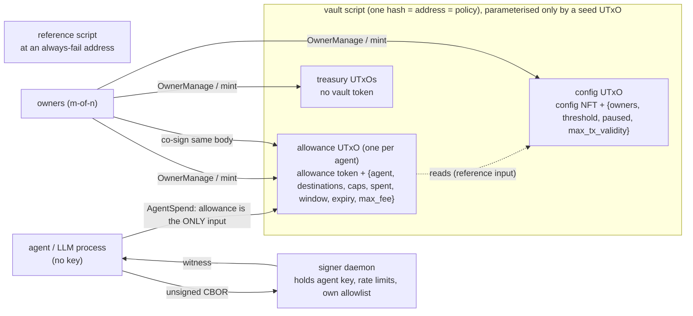

# Agent Allowance Vault (Cardano, preprod MVP)

An m-of-n owner treasury that grants AI agents and bots **scoped allowances**. Agents spend autonomously with only their own key, within limits the chain enforces. Spends over the limits need the agent and the owner threshold to sign one exact tx. Owners can kill one allowance or pause all of them in a single tx.

> **Status: MVP, unaudited, preprod only.** Nothing here has had an independent audit. Don't put mainnet value behind it. See [What an auditor should focus on](#what-an-auditor-should-focus-on).

## Contents
- [Quick start](#quick-start)
- [Architecture](#architecture)
- [On-chain rules](#on-chain-rules)
- [Threat model: every edge and its resolution](#threat-model-every-edge-and-its-resolution)
- [What Cardano can't enforce exactly](#what-cardano-cant-enforce-exactly)
- [Known limitations](#known-limitations)
- [What an auditor should focus on](#what-an-auditor-should-focus-on)
- [Repository layout and versions](#repository-layout-and-versions)

## Quick start

```bash
# on-chain: build, tests (unit + property + adversarial), mutation suite, budget check
scripts/aiken.sh build && scripts/aiken.sh check
scripts/mutate-all.sh            # every guard must be load-bearing (72 mutations)
scripts/budget.sh                # max-size paths < 50% of the per-tx limit

# SDK: unit + emulator flows
cd sdk && npm ci && npx vitest run test/unit test/emulator

# ledger-real: adversarial replay + CLI smoke on a local cardano-node devnet (Docker)
scripts/devnet.sh up
cd sdk && npx vitest run test/yaci      # 34 attacks, each rejected for the expected reason
cli/test/smoke.sh                       # every CLI flow, 17 checks

# preprod demo
demo/preprod.sh setup                   # prints the one address to fund from the faucet
BLOCKFROST_PROJECT_ID=preprod... demo/preprod.sh run   # writes demo/RESULTS.md
```

Toolchain:
- Aiken v1.1.23, stdlib v3.1.0, aiken-design-patterns v1.8.0, fuzz v2.2.0, Plutus V3.
- Lucid Evolution 0.6.5, Node 22+.
- Everything is pinned. Aiken is fetched into `.tools/` and checked against its sha256.

## Architecture



- **One validator, one address, one policy.**
  - The vault is a single Aiken multi-validator (`spend` and `mint`), parameterised only by a one-shot seed `OutputReference`.
  - Rotating owners or changing the threshold rewrites the config datum and nothing else, so **the vault's identity and address never change**.
  - The address has **no stake credential**.
- **Tokens, never datums, decide a UTxO's role.**
  - The config NFT marks the config; it is one-shot, so nobody can forge it.
  - One allowance token marks each allowance. Its name is `blake2b_224(cbor(seed))`, derived from an input the creating tx spends, so names are unique and owners can't mint duplicates.
  - Anything else at the address is treasury, owner-only. A planted look-alike UTxO is therefore inert.
- **Off-chain:**
  - `sdk/` holds the owner and agent builders, a mirror of the on-chain limits that gives early, precise refusals, the intent records, the post-build guards and the signer daemon.
  - `cli/` exposes every flow.
  - The LLM process never holds a key.

### Patterns reused (and where)
| Pattern | Source (pinned) | Used in |
|---|---|---|
| Validity-range normalisation | Anastasia `aiken-design-patterns` v1.8.0 (dependency) | `allowance.ak`, all agent time checks |
| One-shot NFT parameterised by an OutputReference | Sundae `treasury-contracts` `oneshot.ak` (audited by TxPipe and MLabs; ported) | `owner.init_config`. Hardened: name, quantity and destination are pinned. |
| NFT-authenticated reference-input config | Sundae `find_script_hash_registry` (ported) | `config.find_config`. Hardened: canonical address check. |
| No reference scripts on outputs | Sundae `ensure_no_ref_scripts` (ported) | agent path |
| Malformed-datum escape hatch | Sundae `vendor/malformed.ak`, audit finding 3.14 | `OwnerManage` never decodes an allowance datum |
| Threshold multisig | aicone `sundae/multisig` @504e104 (copied subset) | `multisig.ak`. Duplicate owners are rejected because `AtLeast` would count them twice. |
| Single-script-input double-satisfaction guard | Sundae `ensure_compliant_scripts`, Plutonomicon | strengthened to *exactly one input* on the agent path |

Ported code is **not** audited code. The audit covers Sundae's composition at commit 504e104 on stdlib v2, not this one. `aiken-design-patterns` has no published audit.

## On-chain rules

**`AgentSpend { intent_hash }`** is the autonomous path (`onchain/lib/vault/allowance.ak`):
1. **The allowance is the tx's only input.** That rules out treasury access, other allowances and double satisfaction. Collateral is a separate field, and the ledger requires it to be key-locked.
2. Mint, withdrawals, certificates, votes, proposals and treasury donation are all empty.
3. **Spent = allowance in − continuing out**, per asset. With one input and no mint, this covers every payment, any change and **the fee**. Nothing leaves uncounted.
4. Every asset that leaves must be capped. Per asset, the amount must be ≤ `tx_cap`, and the window total ≤ `window_cap`. Also `fee ≤ max_fee`.
5. There is exactly one vault output (the continuing one). It sits at the canonical address, holds the same token, has no reference script, and its **inline datum equals the datum the validator computes**. The agent never writes its own state.
6. Every other output's address must **exactly equal** an allowlisted address, stake part included.
7. Validity must be a closed range inside **one** window (which rolls on its own), entirely before expiry, and no wider than `max_tx_validity_ms`.
8. The config, found by its NFT at the canonical address, must not be paused, and the agent must not be an owner.
9. The agent's key must be in `extra_signatories`. Owner signatures are never consulted on this path.
10. `intent_hash` must be 32 bytes. The full intent JSON rides in tx metadata (label 7041), and `cosign.describeTx` checks the two match.

The input datum is **fully validated on every agent-signed spend**, and every field is deny-by-default. These all deny:
- an empty allowlist, or a non-key destination;
- no lovelace cap, or a zero, negative or wrong-length cap;
- a negative `spent`;
- `period ≤ 0`;
- an expiry that isn't after the window start, or has already passed;
- a negative max fee;
- a bad agent key;
- an unparseable datum.

**`CoSignedSpend { intent_hash }`** is the over-limit path. It needs the same datum validation, intent check, pause check and role-disjointness check, and **the agent's signature plus the owner threshold** in one tx. There is no on-chain proposal object.

**`OwnerManage`** needs the owner threshold only:
- **Treasury moves.**
- **Allowance edits and reclaims.** These never decode the allowance datum, so a corrupted allowance is always reclaimable.
- **Config updates.** These are validated at write time: 1 ≤ threshold ≤ n ≤ 10, no duplicate owners, 28-byte keys, max validity > 0. The NFT is re-locked at the canonical address.

## Threat model: every edge and its resolution

The adversary is a compromised agent key that builds arbitrary transactions.

**Legend:**
- **OC:** enforced on-chain, with an Aiken adversarial test (`onchain/lib/vault/*.test.ak`), and where marked ⛓ also replayed as a raw tx against a real cardano-node (`sdk/test/yaci/adversarial.test.ts`).
- **LG:** enforced by the ledger, replayed on the node.
- **OFF:** an off-chain mitigation, with an SDK test.
- **DOC:** out of scope, with the reason given.

### Value
| Edge | Resolution |
|---|---|
| Fee set absurdly high as a drain | **OC ⛓** The fee is inside `in − continuing`, so it counts against the lovelace cap. `fee ≤ max_fee` is also checked. |
| Change or dust to the agent's own address slipping past the cap | **OC ⛓** There is no separate change: everything leaving the allowance is counted. The agent's address is not an allowed destination unless owners list it. |
| Minting or burning inside an agent spend | **OC ⛓** `mint` must be zero. Certificates, withdrawals and donations are also refused. |
| Non-whitelisted tokens riding along | **OC ⛓** Any asset with a non-zero outflow must be capped. Junk may stay in the continuing output but can't leave. |

### UTxO structure
| Edge | Resolution |
|---|---|
| Several allowance inputs satisfied by one output (double satisfaction) | **OC ⛓** The agent tx must have exactly one input. On owner paths, each allowance is identified by its unique token. |
| Splitting an allowance to multiply its cap | **OC ⛓** Tokens have quantity 1, there is exactly one vault output, and agents can't mint. Owners can't mint a duplicate name either (`create_quantity_two_split_across_outputs`). |
| Fake allowance UTxOs at the script address | **OC ⛓** The role comes from the token. A look-alike with a perfect datum and no token is refused. |
| Continuing output bloated with junk tokens or an oversized datum | **OC ⛓** Continuing ⊆ input (single input, no mint), the datum must equal the computed one, and reference scripts are refused. |
| Datum by hash instead of inline | **OC ⛓** An inline datum is required on the continuing and created outputs. A datum-hash allowance is still reclaimable by owners. |
| Malformed datum the next spend or the reclaim must handle | **OC ⛓** The agent can't write a datum (rule 5). The agent path decodes and fully validates the datum and fails closed. `OwnerManage` never decodes it. Property tests run in three layers, over generated malformed and garbage datums: `is_well_formed` rejects, the agent spend fails, and the owner reclaim succeeds. |

### Time
| Edge | Resolution |
|---|---|
| Unbounded lower or upper validity bound | **OC ⛓** Only `ClosedRange` is accepted. |
| Range that straddles two windows or stretches the current one | **OC ⛓** The whole range must sit inside one window, and its width must be ≤ `max_tx_validity_ms`. |
| Inclusive/exclusive off-by-one at window edges | **OC** Bounds are normalised explicitly. Tests cover the first and last ms of the window, the first ms of the next window, the last ms before expiry, expiry itself, and both inclusive and exclusive bounds. |
| Period 0, window start in the future, integer overflow | **OC** `period > 0` is required. A future start is refused because `lower ≥ window_start`. Plutus integers are unbounded, and a test uses 10³⁰ caps. |

### Destinations and config
| Edge | Resolution |
|---|---|
| Allowed payment credential with a swapped stake credential | **OC ⛓** Destinations are matched on the **exact full address**. Tests cover a swapped, added or removed stake part, and a pointer. |
| Membership-proof schemes (reuse, empty set, wrong set) | **DOC** There are no proofs. The allowlist is an inline list of at most 10 addresses read from the authenticated datum, so there is no proof to reuse or point at the wrong set. An empty set denies everything. |
| Allowlist or config so large every spend blows the budget | **OC** Sizes are bounded: ≤ 10 owners, ≤ 10 destinations, ≤ 5 assets. Config is checked at write time; an oversize allowance fails closed and owners reclaim it. `scripts/budget.sh`: worst case 35% mem / 20% cpu, including building the test tx. |
| Forged or stale config reference | **OC ⛓ / LG ⛓** The config is identified by the one-shot NFT at the canonical address, so a look-alike under another policy is refused. A reference input must be unspent, so a tx built against a superseded config can't land. |
| Invalid owner sets: threshold > n, threshold 0, no owners, duplicates | **OC** `is_valid_config` runs at init and on every update, with unit and property tests (exact characterisation). |
| Agent key that is also an owner key | **OC ⛓** Checked against the live config on every agent and co-signed spend, so it covers allowances granted before a rotation. The SDK also refuses it at grant time. |

### Revocation
| Edge | Resolution |
|---|---|
| Agent front-runs a visible revocation by spending its remaining cap | **DOC** The loss is bounded by what the window still allows: at most `window_cap − spent`, and at most `tx_cap` per tx. Revocation can't be atomic with "now", because the agent's tx can land first. Owners who suspect compromise should **pause first**: one tx halts every allowance. |
| Revoke and spend in the same block | **LG ⛓** Both consume the same UTxO, so exactly one lands. |

### Infra
| Edge | Resolution |
|---|---|
| Anyone deregistering the vault's stake credential | **DOC** The vault address has no stake credential and the design uses no withdraw-zero, so there is nothing to deregister. |
| Staking rewards stranded on the vault's credential | **DOC** No stake credential means no rewards. Trade-off: the treasury is unstaked. ADA someone sends to vault-payment + their-stake earns rewards for *their* key, and owners can still spend it. |
| Reference-script UTxO spent or removed | **OC ⛓** It is parked at an always-fail address (`ref_holder`), so nobody can spend it. The SDK falls back to an inline script if it is ever missing. |
| The allowance used as collateral and lost on a phase-2 failure | **LG ⛓** Collateral must be key-locked, so the node rejects a script-locked collateral input. The agent posts collateral from its own small key UTxO. |
| Network id mixups (preprod vs mainnet) | **LG ⛓ / OFF** The ledger rejects wrong-network outputs (`WrongNetwork`, replayed). The SDK refuses `Mainnet`, checks every output is network 0, requires a `preprod…` Blockfrost id, and checks the provider's network magic. |
| UTxO lookup inconsistencies across providers | **OFF** This was **observed on preprod**: Blockfrost served spent UTxOs after confirmation. Mitigations:<br>- One provider per session.<br>- Every vault-state read is cross-checked against the tx-level view, which filters consumed outputs.<br>- `awaitSettled` waits until the provider's address views settle.<br>- On "inputs already spent", **the attempted tx's fate is resolved first**: rebuild only if it can never land, and treat "already landed" as success.<br>- Agent spends are idempotent by intent id: journal plus chain scan. See [Integrator guidance](#integrator-guidance-paying-exactly-once). Tests: `sdk/test/yaci/idempotency.test.ts` covers 4 double-pay scenarios on a real node. |

### Off-chain
| Edge | Resolution |
|---|---|
| Hot key inside the LLM process | **OFF** `signer/` is a separate process on a Unix socket (mode 0600) and is the only holder of the agent key. It re-decodes every tx, applies its own allowlist, short-TTL, rate-limit and daily-budget policy, returns only a witness, and appends an audit log. KMS/HSM integration is out of scope. |
| Prompt injection driving repeated max spends | **OC + OFF** The on-chain caps bound the damage. The signer adds per-hour and per-day limits the chain can't express. Tested: a repeated-spend loop is refused. |
| Pre-signed txs held back and submitted later | **OC ⛓ / LG ⛓** Validity width is ≤ `max_tx_validity_ms`, so a held-back tx dies with `OutsideValidityInterval` (replayed). Any intervening spend also invalidates it, because its input is gone. The signer refuses long TTLs. |

## Integrator guidance: paying exactly once

**The trap.** A node rejecting your tx with "All inputs are spent" / `BadInputsUTxO` does **not** mean your payment failed. It can mean *your own earlier submission already landed* while your provider's view was stale. Rebuilding and resubmitting then **pays twice**, because the rebuild reads the newer state and constructs a fresh, valid payment. This happened in practice on preprod with Blockfrost: confirmed txs' inputs were still served as unspent for a while afterwards.

**What the SDK does** (`sdk/src/idempotency.ts`, `sdk/src/pay.ts`):
1. **Every tx has a TTL.** After it, the ledger guarantees the tx can never land, so "did it land?" always has a final answer. Agent txs are bounded by `max_tx_validity_ms`; owner txs default to 10 minutes.
2. **Every agent spend carries a required intent id** (`--intent-id`, e.g. the invoice id). It is part of the hashed intent record.
3. **Before building**, `payOnce` checks two sources:
   - **The operator journal** (`$VAULT_HOME/intents.jsonl`). It is written *before* submitting, so a crash right after submit is recoverable.
   - **The chain**: recent txs of the allowance token, each carrying its intent record.

   If the intent has landed, it returns `already-paid` and builds nothing. If an earlier attempt is still undecided, it **waits for that attempt's fate** instead of paying again.
4. **On "inputs already spent"**, it resolves the attempted tx's fate before anything else:
   - **landed:** the hash is on-chain, or the provider names it as the spender of its inputs. This is treated as success.
   - **never:** another tx spent its inputs, or its TTL passed and it isn't on-chain. Only this case rebuilds.
   - **unknown:** it re-checks, bounded by the TTL.

**What you must do as an integrator:**
- **Derive the intent id from the business object** (invoice id, payout id), never from a timestamp or a random value per attempt. Retries must reuse it.
- **Persist the journal durably**, next to the agent, and back it up. The chain scan is a safety net: it only covers the last N txs of *one* allowance.
- **Scope matters.** The journal is operator-wide, so it refuses an id even on another allowance or vault. The chain scan is per allowance. If you run several operators, give them disjoint id spaces or a shared journal.
- **Don't shorten the TTL grace below your provider's indexing lag.** A decision of "never" must not be made before the provider could have shown the tx.
- **Owner commands** (fund, grant, revoke, …) get the same fate check on resubmission. They are not keyed by an id across separate invocations, so don't blindly re-run a timed-out owner command. Check `vault info` first.

**What the demo runs actually did** (verified on-chain, merchant `addr_test1vznmgqa7…`):

| Vault | INV-1001 | INV-1002 | INV-1003 |
|---|---|---|---|
| `addr_test1wpzj0k…` (attempt 2) | 4 tADA | 8 tADA | none |
| `addr_test1wrsmqm…` (attempt 3) | 4 tADA | 8 tADA | none |
| `addr_test1wq4l2x…` (final, `demo/RESULTS.md`) | 4 tADA | 8 tADA | 9 tADA |

- The final run paid each intent exactly once.
- No allowance ever paid the same intent twice.
- But because I restarted the demo from scratch with the same invoice ids, **the merchant received INV-1001 and INV-1002 three times each (45 tADA instead of 21).** Nothing stopped it, since each restart was a fresh vault and there was no intent journal yet.
- With the current SDK, the operator journal refuses a reused id. Each demo run now gets a per-run id suffix and includes a retry step, which reports "already paid".

## What Cardano can't enforce exactly

1. **Fixed windows allow a 2× burst.** Each fixed window is ≤ `window_cap`. But **any interval of length `period` can see up to 2 × `window_cap`**: the cap at the end of window N, then again at the start of N+1. `tx_cap` bounds each tx. A true sliding window needs per-spend history, which is unbounded state; it is planned for v2.
2. **"Now" is an interval.** Scripts see only the tx's validity range, at 1-second slot granularity. The agent chooses where in the window a spend lands, but the whole range must fit inside one window.
3. **"Instant" means the next block.** A pause or revoke takes effect when its tx is included. Agent txs ordered before it, in the same block or earlier, still land. Worst case is bounded by the remaining window and `tx_cap`.
4. **Intent is a commitment, not content.** Plutus can't see metadata. The redeemer carries the 32-byte hash, so the chain proves *a* record was committed, and only off-chain tools check *which* one.
5. **The lovelace cap includes fees and min-ADA.** The fee always counts, so an allowance without a lovelace cap can never be spent. The continuing output can't drop below min-ADA.
6. **Throughput is one spend per allowance per block** (about 20 s on preprod), because spends run in sequence on one UTxO. More throughput means more allowances.
7. **Owner/agent disjointness** is enforced at spend time. A rotation can't scan every allowance.
8. **Pause applies to the agent paths only.** Cardano can't stop an agent adding its signature to an owner-only tx, but that tx needs the owner threshold anyway, so it grants nothing.

## Known limitations
- **Unaudited.** This is new design: I found no audited Cardano allowance or session-key contract to copy. The ported Sundae code no longer carries the audit, and `aiken-design-patterns` has no published audit.
- **stdlib v3.1.0.** The v4 migration (stdlib v4, fuzz v3, ADP v1.9.0) is scheduled as milestone M6, before any audit.
- **The adversarial replay ran on PV10, not PV11.** It ran on Yaci DevKit v0.11.0-beta1 (cardano-node 10.5.0, PV10). Yaci v0.12.0-beta5 (PV11) stalls after its block-producer hand-off; before stalling it passed 33 of 34. PV11 evidence comes from the preprod demo (`demo/RESULTS.md`), where honest spends, refusals, the co-signed spend, pause and revoke all ran on the real PV11 ledger. The attack suite itself was not replayed on preprod.
- **Lucid Evolution limitations:**
  - It has no "use this UTxO as collateral" API. The SDK forces it through the coin-selection pool and then **asserts** the body's collateral is exactly that UTxO, failing closed if not.
  - Lucid's emulator does not run Plutus scripts on submit. Emulator tests cover honest flows, which Lucid's local UPLC still evaluates against the real validator. Adversarial claims are only made from the real-node suite.
- **Over-limit spends draw only from the allowance UTxO**, whose datum is carried over unchanged. Owners top it up (`allowance edit --top-up`) first if needed.
- **Only key-address destinations, ADA plus native tokens, at most 10 owners, 10 destinations and 5 assets.**
- **The signer daemon is a reference implementation.** Its state is in memory, so restarts reset the rate-limit counters. Keys live in local files and there is no KMS/HSM.
- **No UI, no mainnet, no script destinations, no governance.** All are out of scope by design.

## What an auditor should focus on
1. **`onchain/lib/vault/allowance.ak` `agent_spend`** is the security core. Check that "exactly one input + zero mint + no certificates/withdrawals/donation ⇒ `in − continuing` equals the total outflow including the fee" holds under every Conway feature. Pay particular attention to deposits and refunds, which are refused here, and to the treasury donation field.
2. **Window arithmetic.** Check floor division, roll-over (`k > 0` resets `spent`), and bound normalisation. Look for an interval that the normaliser maps into one window but the ledger treats as wider.
3. **`is_well_formed`.** Confirm that no field value reads as more permissive than intended. Deny-by-default is required by the spec.
4. **Config authenticity.**
   - `find_config` trusts the first reference or spent input holding the NFT. Ask whether a tx can include two NFT-bearing inputs, given the NFT is unique.
   - When the config is spent and treasury inputs are spent in the same tx, the *old* owners govern both.
5. **Mint policy (`manage_allowances`).** Check that names are derived from spent inputs, quantity is exactly ±1, and the output is canonical. Confirm the config NFT can never be re-minted or burned.
6. **`OwnerManage` is deliberately unconstrained beyond the threshold** (owners are trusted). Verify that this can't be reached by a non-owner, for example through a redeemer that maps to it or a role confusion.
7. **Off-chain:**
   - the `allowanceName` CBOR encoding must match Aiken `cbor.serialise`;
   - the intent hash binding;
   - signer policy decoding (it parses untrusted CBOR).
8. **Tooling.** Run `scripts/mutate-all.sh`. Every listed guard must be killed by a test. Add mutations for anything you think is untested.

## Repository layout and versions
```
onchain/            Aiken project: validators/{vault,ref_holder}.ak, lib/vault/*.ak (+ *.test.ak)
sdk/src/            data, vault, chain, limits (on-chain mirror), agent, owner, cosign, intent, guards, provider, signer/
sdk/test/           unit/, emulator/ (honest flows), yaci/ (attacker builder + adversarial replay on a real node)
cli/                `cli/vault` + test/smoke.sh
demo/               preprod.sh (+ RESULTS.md after a run)
scripts/            aiken.sh, mutate.sh, mutate-all.sh, mutations.tsv, budget.sh, devnet.sh
spike/              M0 spike (SDK selection evidence)
```

Test counts at the time of writing:

| Area | Count |
|---|---|
| On-chain Aiken tests | 182 (168 unit/adversarial, 14 property) |
| Mutations killed | 72 |
| SDK unit + emulator tests | 38 |
| Real-node adversarial replays | 34 |
| Real-node double-pay scenarios | 4 |
| CLI smoke checks | 19 |
| Preprod demo txs (all links in `demo/RESULTS.md`) | 12, plus 5 refusals |
